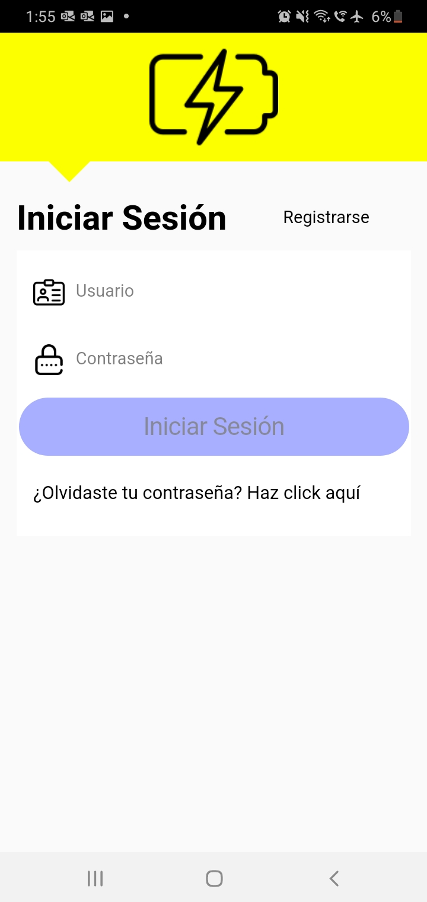

# LightArduino



## Vision general 
La aplicacion movil LightArduino, tiene como objetivo principal de ser el receptor de la informacion del dispositivo prototipo Arduino
## Tecnologias Utilizadas
* [NodeJS](https://nodejs.org/en/)
* [Visual Studio Code IDE](https://code.visualstudio.com/)
* [TypeScript](https://www.typescriptlang.org/)
* [Ionic Framwork](https://ionicframework.com/)
* [Android Studio](https://developer.android.com/studio)
* [Github](https://github.com)
## Configuracion del Proyecto AWS Lambda Serverless - LightArduino

1. Descarga e instala [NodeJS](https://nodejs.org/en/).
2. Descarga e instala y configura localmente * [Amazon Web Services CLI](https://aws.amazon.com/ s/)
3. Descarga e instala [Visual Studio Code IDE](https://code.visualstudio.com/).
4. Descarga e instala [GIT](https://git-scm.com/).
5. clona este repositorio [LightArduino](https://github.com/cb161769/MobileTesisProject--Ionic)
6. Abre el proyecto desde Visual Studio Code.
7. luego ejecuta el siguente 
script: `npm install`
8. luego de insertar las variables de entorno correspondiantes en el archivo `enviroment.ts` , ejecuta el siguiente comando 
script : `npm run start`
## Logs

Se encargan de imprimir los mensajes que se van a visualiar en *[Amazon Web Services CloudWatch](https://aws.amazon.com/es/cloudwatch/) 
```typescript 
  /**
   * @method genericLogMethod
   * @description this method logs to the dynamoDb Database
   * @param urlPost
   * @param bodyPost
   * @returns
   */
  genericLogMethod(urlPost: string, bodyPost: any) {
    // debugger;
    Network.addListener("networkStatusChange", async (status) => {
      if (status.connected) {
        const log = {
          userName: bodyPost.userName,
          timeStamp: bodyPost.timeStamp,
          action: bodyPost.action,
          route: bodyPost.route,
          logLevel: bodyPost.logLevel,
          logError: bodyPost.logError,
        };
        const promise = new Promise((resolve, reject) => {
          this.httpClient
            .post(urlPost, log)
            .toPromise()
            .then(
              (res) => {
                resolve(res);
              },
              (msg) => {
                reject(msg);
              }
            );
        });
        return promise;
      } else {
        const toast = await this.toastController.create({
          message: "ha ocurrido un error de conexion",
          duration: 2000,
        });
        toast.present();
      }
    });
  }
```
## Ejemplo de entendimento de codigo fuente 

```typescript
/**
    * this method confirms the User's Sing up
    * @param username userName
    * @param confirmationCode user's confirmation code
    */
    confirmSingUp(username: any, confirmationCode: any) {
    try {
      const userConfirmed = Auth.confirmSignUp(username, confirmationCode);
      return userConfirmed;

    } catch (error) {
      this.returnErrors(error.message);
      console.log(error);
    }
   }
```
Cada codigo realizado en esta aplicacion tiene acompañada su debida descipción.
## Estructura del proyecto
* `.vscode`: contiene los archivos de configuración para el IDE de Visual Studio Code.
* `ligthArduino/android`: contiene los archivos para  publicar el APP en anrdoid
* `lightArduino/ios`: contiene los archivos para  publicar el APP en Ios
* `lightArduino/e2e`: contiene los archivos para realizar unit tests.
* `lightArduino/node_modules`: contiene las librerias a utilizar en este proyecto.
* `lightArduino/resources`: contiene los archivos que tienen los recursos para publicar el APP en Android.
* `lightArduino/src/app`: esta carpeta contiene los archivos propios de las pantallas,servicios etcetera que se utilizan en el proyecto.
* `lightArduino/src/enviroments`: contiene los archivos necesarios para los ambientes de desarrollo del aplicacion
* `lightArduino/src/proxy`: es el archivo de configuracion de proxy del proyecto.


